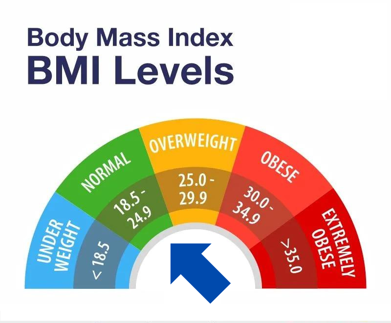

# BMI Calculator

This BMI (Body Mass Index) calculator calculates and categorizes BMI based on user-provided height (feet and inches) and weight in pounds. It displays the BMI value along with a corresponding category and image representation.

## Features

- **Interactive Input:** Collects user data through form inputs for height (feet and inches) and weight.
- **BMI Calculation:** Calculates BMI using the formula: \[ BMI = \left( \frac{{\text{{weight (lb)}}}}{{\text{{height (in)}}^2}} \right) \times 703 \]
- **BMI Categories:** Categorizes BMI into Underweight, Normal Weight, Overweight, Obese, and Extreme Obese ranges.
- **Visual Feedback:** Displays corresponding images for each BMI category.
- **Validation:** Validates user inputs for accurate calculations and displays error messages for invalid entries.

## Usage

1. **Open the Application:**
   - Open `index.html` in a web browser.

2. **Input Instructions:**
   - Enter your height in feet and inches.
   - Enter your weight in pounds.

3. **Calculating BMI:**
   - Click on the "Calculate BMI" button.

4. **View Results:**
   - BMI category and corresponding image will be displayed based on the calculated BMI.
   - Error messages will be shown for invalid or incomplete inputs.

5. **Example Output:**
   - Example of BMI calculation and category display:

    Your BMI is 23.5, indicating your weight is in the Normal or Healthy Weight Range.

    

6. **Closing Remarks:**
- Ensure accurate inputs to receive correct BMI categorization and visual representation.

## Files Included

- `index.html`: HTML file containing the BMI calculator form and JavaScript integration.
- `style.css`: CSS file for basic styling of the BMI calculator.
- `script.js`: JavaScript file containing BMI calculation logic and event listeners.
- `assets/`: Directory containing images for BMI categories.

## License

This project is licensed under the MIT License - see the LICENSE file for details.